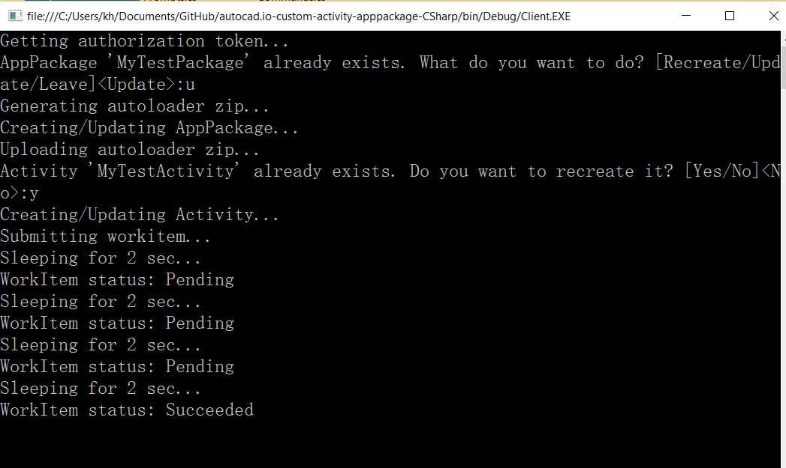

# Design Automation (called AutoCAD IO in the past) V2 API C# samples -- Create custom Activity and AppPackage

##Description
This is C# sample to demonstrate custom Activities and AppPackages creation. This is the most
common use case that the AutoCAD.IO can run the custom command (defined in the custom package) on the cloud.

##Dependencies

* Visual Studio 2012, 2013. 2015 should be also fine, but not yet been tested.
* [ObjectARX SDK] (http://usa.autodesk.com/adsk/servlet/index?siteID=123112&id=773204). The SDK version depends on which AutoCAD verison you want to test with the AppPackage locally. In current test, the version is 2016.

##Setup/Usage Instructions
* Unzip ObjectARX SDK. Add AcCoreMgd, AcDbMgd and acdbmgdbrep from SDK/inc to the the project **CrxApp**.  "Copy Local" = False.
* NuGet the Newtonsoft.json package to project CrxApp.
* Build project **CrxApp**. It is better test with local AutoCAD to verify the process. Steps:
  * Open AutoCAD (in this test, the version is 2016)
  * Open [demo drawing](demofiles/demodrawing.dwg). Run command "netload", select the binary dll of CrxApp. Allow AutoCAD to load it.
  * Run command "test", select [demo json file](demofiles/demojson.json). Specify a output folder. 
  * Finally the blocks name list and layers name list will dumped out.
* Restore the packages of project **Client** by [NuGet](https://www.nuget.org/). The simplest way is right click of the project>>"Manage NuGet Packages for Solution" >> "Restore" (top right of dialog)
* Apply credencials of AutoCAD.IO from https://developer.autodesk.com/. Put your consumer key and secret key at  line 19 and 20 of [program.cs](Client/Program.cs) 
* Run project **Client**, you will see a status in the console:
[] 
* if everything works well, a zip file and a report file will be downloaded at **MyDocuments**.
* if there is any error with the process, check the report file what error is indicated in the process.

Please refer to [AutoCAD.IO V2 API documentation](https://developer.autodesk.com/api/autocadio/v2/#tutorials) for more information such as how to setup a project with AutoCAD.IO.

## Questions

Please post your question at our [forum](http://forums.autodesk.com/t5/autocad-i-o/bd-p/105).

## License

These samples are licensed under the terms of the [MIT License](http://opensource.org/licenses/MIT). Please see the [LICENSE](LICENSE) file for full details.

##Written by 

Jonathan Miao & Albert Szilvasy
